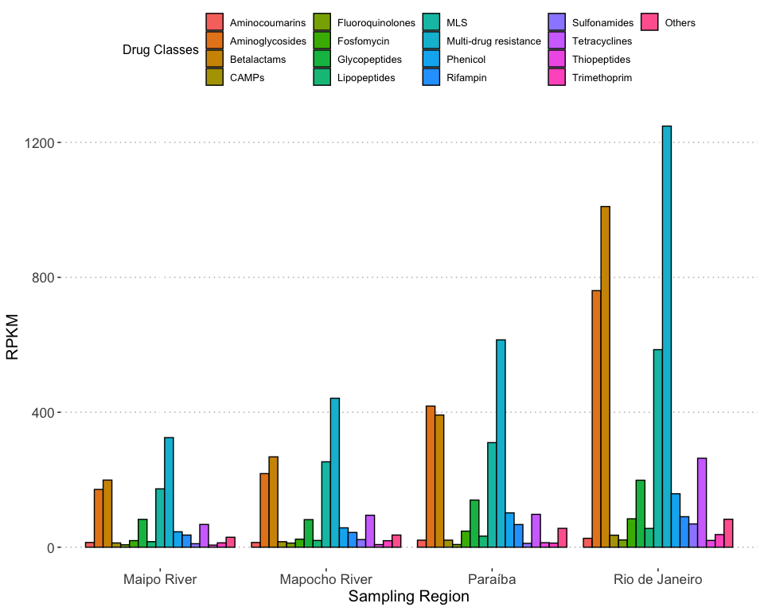
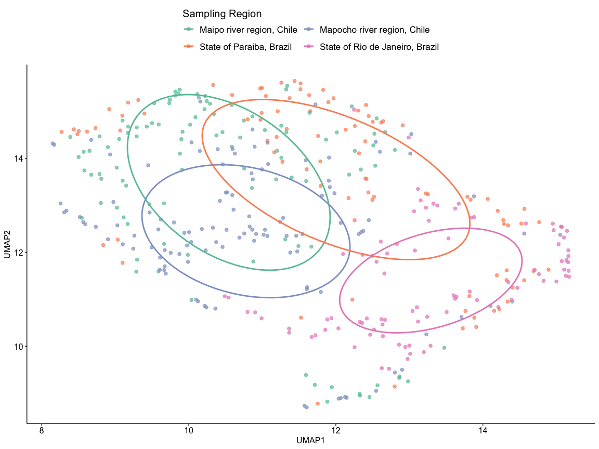
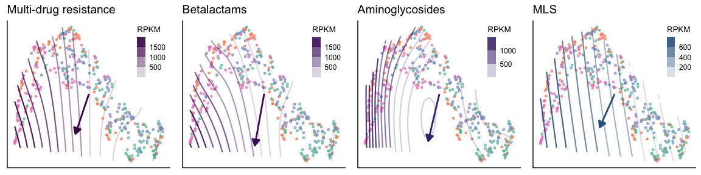

Antimicrobial Resistance
================

``` r
library("dplyr")
library("readr")
library("ggplot2")
library("stringr")
library("tidyverse")
library("vegan")
library("picante")
library("colorspace")
library("gridExtra")
library("ggnewscale")
library("ggpubr")
library("viridis")

sessionInfo()
```

    ## R version 4.2.2 (2022-10-31)
    ## Platform: x86_64-apple-darwin17.0 (64-bit)
    ## Running under: macOS Big Sur ... 10.16
    ## 
    ## Matrix products: default
    ## BLAS:   /Library/Frameworks/R.framework/Versions/4.2/Resources/lib/libRblas.0.dylib
    ## LAPACK: /Library/Frameworks/R.framework/Versions/4.2/Resources/lib/libRlapack.dylib
    ## 
    ## locale:
    ## [1] en_US.UTF-8/en_US.UTF-8/en_US.UTF-8/C/en_US.UTF-8/en_US.UTF-8
    ## 
    ## attached base packages:
    ## [1] stats     graphics  grDevices utils     datasets  methods   base     
    ## 
    ## other attached packages:
    ##  [1] viridis_0.6.2     viridisLite_0.4.1 ggpubr_0.6.0      ggnewscale_0.4.8 
    ##  [5] gridExtra_2.3     colorspace_2.1-0  picante_1.8.2     nlme_3.1-162     
    ##  [9] ape_5.7-1         vegan_2.6-4       lattice_0.21-8    permute_0.9-7    
    ## [13] lubridate_1.9.2   forcats_1.0.0     purrr_1.0.1       tidyr_1.3.0      
    ## [17] tibble_3.2.1      tidyverse_2.0.0   stringr_1.5.0     ggplot2_3.4.2    
    ## [21] readr_2.1.4       dplyr_1.1.2      
    ## 
    ## loaded via a namespace (and not attached):
    ##  [1] tidyselect_1.2.0 xfun_0.39        splines_4.2.2    carData_3.0-5   
    ##  [5] vctrs_0.6.2      generics_0.1.3   htmltools_0.5.5  yaml_2.3.7      
    ##  [9] mgcv_1.8-42      utf8_1.2.3       rlang_1.1.0      pillar_1.9.0    
    ## [13] glue_1.6.2       withr_2.5.0      lifecycle_1.0.3  munsell_0.5.0   
    ## [17] ggsignif_0.6.4   gtable_0.3.3     evaluate_0.20    knitr_1.44      
    ## [21] tzdb_0.3.0       fastmap_1.1.1    parallel_4.2.2   fansi_1.0.4     
    ## [25] broom_1.0.4      Rcpp_1.0.10      backports_1.4.1  scales_1.2.1    
    ## [29] abind_1.4-5      hms_1.1.3        digest_0.6.31    stringi_1.7.12  
    ## [33] rstatix_0.7.2    grid_4.2.2       cli_3.6.1        tools_4.2.2     
    ## [37] magrittr_2.0.3   cluster_2.1.4    car_3.1-2        pkgconfig_2.0.3 
    ## [41] MASS_7.3-58.3    Matrix_1.5-4     timechange_0.2.0 rmarkdown_2.25  
    ## [45] rstudioapi_0.14  R6_2.5.1         compiler_4.2.2

``` r
metadata_df <- read_csv("./input/metadata.csv")
# original megares records with >= 90% identity across >= 50% coverage have been collapsed into a single record
amr_df <- read_csv("./input/antimicrobial_resistance/final_megares.csv")
unique(amr_df$MegaResClass)
```

    ##  [1] "Aminoglycosides"                         
    ##  [2] "Fosfomycin"                              
    ##  [3] "Multi-drug_resistance"                   
    ##  [4] "Multi-drug resistance"                   
    ##  [5] "betalactams"                             
    ##  [6] "Cationic_antimicrobial_peptides"         
    ##  [7] "Lipopeptides"                            
    ##  [8] "Rifampin"                                
    ##  [9] "Bacitracin"                              
    ## [10] "Glycopeptides"                           
    ## [11] "Phenicol"                                
    ## [12] "MLS"                                     
    ## [13] "Fluoroquinolones"                        
    ## [14] "Trimethoprim"                            
    ## [15] "Elfamycins"                              
    ## [16] "Fusidic_acid"                            
    ## [17] "Mupirocin"                               
    ## [18] "Metronidazole"                           
    ## [19] "Aminocoumarins"                          
    ## [20] "Thiopeptides"                            
    ## [21] "Tetracyclines"                           
    ## [22] "Nucleosides"                             
    ## [23] "Sulfonamides"                            
    ## [24] "Tetracenomycin"                          
    ## [25] "Mycobacterium_tuberculosis-specific_Drug"

``` r
amr_df$MegaResClass <- str_replace(amr_df$MegaResClass, "Multi-drug_resistance", "Multi-drug resistance")
amr_df$MegaResClass <- str_replace(amr_df$MegaResClass, "Fusidic_acid", "Fusidic acid")
amr_df$MegaResClass <- str_replace(amr_df$MegaResClass, "betalactams", "Betalactams")
amr_df$MegaResClass <- str_replace(amr_df$MegaResClass, "Cationic_antimicrobial_peptides", "CAMPs")
temp_df <- amr_df %>% group_by(MegaResClass) %>% summarize(n = sum(RPKM))
for (temp_name in (temp_df %>% filter(n < 4000) %>% pull(MegaResClass))) {
  amr_df$MegaResClass <- str_replace(amr_df$MegaResClass, temp_name, "Others")
}
unique(amr_df$MegaResClass)
```

    ##  [1] "Aminoglycosides"       "Fosfomycin"            "Multi-drug resistance"
    ##  [4] "Betalactams"           "CAMPs"                 "Lipopeptides"         
    ##  [7] "Rifampin"              "Others"                "Glycopeptides"        
    ## [10] "Phenicol"              "MLS"                   "Fluoroquinolones"     
    ## [13] "Trimethoprim"          "Aminocoumarins"        "Thiopeptides"         
    ## [16] "Tetracyclines"         "Sulfonamides"

``` r
# Sum RPKM for genes belonging to the same class
amr_by_class <- amr_df %>% 
  group_by(Sample, MegaResClass) %>% 
  summarize(RPKM_sum = sum(RPKM)) %>% 
  mutate(Group = setNames(metadata_df$group, metadata_df$sample_id)[Sample], 
         Location = setNames(metadata_df$collection_site, metadata_df$sample_id)[Sample])

# Add samples where no AMR gene was identified to the summarized dataframe
amr_df_all_samples <- as.data.frame(expand.grid(metadata_df$sample_id, unique(amr_df$MegaResClass)))
colnames(amr_df_all_samples) <- c("Sample", "MegaResClass")
amr_df_all_samples <- amr_df_all_samples %>% 
  left_join(amr_by_class %>% select(Sample, MegaResClass, RPKM_sum), 
            by = c("Sample" = "Sample", "MegaResClass" = "MegaResClass"))
amr_df_all_samples$RPKM = ifelse(is.na(amr_df_all_samples[["RPKM_sum"]]), 
                                 rep(0, nrow(amr_df_all_samples)), 
                                 amr_df_all_samples[["RPKM_sum"]])
amr_df_all_samples <- amr_df_all_samples %>% 
  mutate(Region = setNames(metadata_df$region, metadata_df$sample_id)[Sample], 
         Location = setNames(metadata_df$collection_site, metadata_df$sample_id)[Sample]) %>%
  select(-RPKM_sum)

amr_df_all_samples_to_plot <- amr_df_all_samples %>% 
  group_by(Region, MegaResClass) %>% 
  summarize(RPKM_mean = mean(RPKM), RPKM_sd = sd(RPKM))

# Find colors for different drug classes
gg_color_hue <- function(n) {
  hues = seq(15, 375, length = n + 1)
  hcl(h = hues, l = 65, c = 100)[1:n]
}
drug_classes <- sort(unique(amr_df$MegaResClass))
drug_classes <- c(drug_classes[drug_classes != "Others"], "Others")
my_colors <- setNames(gg_color_hue(17), drug_classes)
amr_df_all_samples_to_plot$MegaResClass <- factor(amr_df_all_samples_to_plot$MegaResClass,
                                                  levels = names(my_colors))

amr_barplot <- ggplot(amr_df_all_samples_to_plot) + 
  geom_bar(aes(x = Region, y = RPKM_mean, fill = MegaResClass), color = "black", stat = "identity", position = "dodge") +
  scale_fill_manual("Drug Classes", values = my_colors) + 
  scale_x_discrete(labels = c("Mapocho river region, Chile" = "Mapocho River", 
                              "Maipo river region, Chile" = "Maipo River", 
                              "State of Paraiba, Brazil" = "Paraíba", 
                              "State of Rio de Janeiro, Brazil" = "Rio de Janeiro")) +
  labs(x = "Sampling Region", y = "RPKM") +
  theme_pubclean() +
  theme(axis.title = element_text(size = 15), axis.text = element_text(size = 13))
amr_barplot
```

<!-- -->

``` r
# Slightly modify functions from the vagan package so that the UMAP ordinates can be used as input.

vectorfit_modified <- function(X, P, permutations = 0, strata = NULL, ...) {
  EPS <- sqrt(.Machine$double.eps)
  # directly make the fitting unweighted
  w <- rep(1, nrow(X))
  P <- as.matrix(P)
  if (nrow(P) != nrow(X)) {stop("input data have non-matching numbers of observations")}
  Xw <- .Call("do_wcentre", X, w)
  Pw <- .Call("do_wcentre", P, w)
  colnames(Pw) <- colnames(P)
  nc <- ncol(X)
  Q <- qr(Xw)
  H <- qr.fitted(Q, Pw)
  heads <- qr.coef(Q, Pw)
  r <- diag(cor(H, Pw) ^ 2)
  r[is.na(r)] <- 0
  heads <- decostand(heads, "norm", 2)
  heads <- t(heads)
  if (is.null(colnames(X))) {
    colnames(heads) <- paste("Dim", 1:nc, sep = "")
  } else {
    colnames(heads) <- colnames(X)
  }
  ## make permutation matrix for all variables handled in the next loop
  nr <- nrow(X)
  permat <- vegan:::getPermuteMatrix(permutations, nr, strata = strata)
  if (ncol(permat) != nr) {
    stop(gettextf("'permutations' have %d columns, but data have %d rows", ncol(permat), nr))
  }
  permutations <- nrow(permat)
  if (permutations) {
    ptest <- function(indx, ...) {
      take <- P[indx, , drop = FALSE]
      take <- .Call("do_wcentre", take, w)
      Hperm <- qr.fitted(Q, take)
      diag(cor(Hperm, take)) ^ 2
    }
    permstore <- sapply(1:permutations, function(indx, ...) ptest(permat[indx,], ...))
    ## Single variable is dropped to a vector, and otherwise
    ## permutations are the matrix columns and variables are rows
    if (!is.matrix(permstore)) {permstore <- matrix(permstore, ncol = permutations)}
    permstore <- sweep(permstore, 1, r - EPS, ">=")
    validn <- rowSums(is.finite(permstore))
    pvals <- (rowSums(permstore, na.rm = TRUE) + 1) / (validn + 1)
  } else {pvals <- NULL}
  sol <- list(arrows = heads, r = r, permutations = permutations, pvals = pvals)
  sol$control <- attr(permat, "control")
  class(sol) <- "vectorfit"
  sol
}

envfit_modified <- function(coord_matrix, env, permutations = 999, na.rm = FALSE, strata = NULL, ...) {
  vectors <- NULL
  seed <- NULL
  keep <- complete.cases(coord_matrix) & complete.cases(env)
  if (any(!keep)) {
    if (!na.rm) {stop("missing values in data: consider na.rm = TRUE")}
    coord_matrix <- coord_matrix[keep, , drop = FALSE]
    ## drop any lost levels, explicitly don't include NA as a level
    env <- droplevels(env[keep,, drop = FALSE], exclude = NA)
    na.action <- structure(seq_along(keep)[!keep], class = "omit")
  }
  ## make permutation matrix for all variables handled in the next loop
  nr <- nrow(coord_matrix)
  permat <-  vegan:::getPermuteMatrix(permutations, nr)
  if (ncol(permat) != nr) {
    stop(gettextf("'permutations' have %d columns, but data have %d rows", ncol(permat), nr))
  }
  vectors <- vectorfit_modified(coord_matrix, env, permutations, ...)
  sol <- list(vectors = vectors)
  sol
}

ordisurf_modified <- function(coord_matrix, y, choices = c(1, 2), knots = 10, family = "gaussian", col = "red", 
                              isotropic = TRUE, thinplate = TRUE, bs = "tp", fx = FALSE, add = FALSE, display = "sites", 
                              main, nlevels = 10, levels, npoints = 31, labcex = 0.6, 
                              bubble = FALSE, cex = 1, select = TRUE, method = "REML", gamma = 1, plot = TRUE,
                              lwd.cl = par("lwd"), ...) {
  weights.default <- function(object, ...) {NULL}
  if (!missing(thinplate)) {
    warning("use of 'thinplate' is deprecated and will soon be removed;\nuse 'isotropic' instead")
    isotropic <- thinplate
  }
  GRID <- npoints
  w <- rep(1, nrow(coord_matrix))
  yname <- deparse(substitute(y))
  kk <- complete.cases(coord_matrix) & !is.na(y)
  if (!all(kk)) {
    coord_matrix <- coord_matrix[kk, , drop = FALSE]
    y <- y[kk]
    w <- w[kk]
  }
  x1 <- coord_matrix[, 1]
  x2 <- coord_matrix[, 2]
  if (!(missfx <- missing(fx)) && missing(knots)) {
    warning("requested fixed d.f. splines but without specifying 'knots':\nswitching to 'fx = FALSE'")
  }
  if (length(fx) > 2L) {
    warning("length of 'fx' supplied exceeds '2': using the first two")
  }
  fx <- rep(fx, length.out = 2)
  if (!missfx) {
    if ((miss.select <- missing(select)) && any(fx)) {
      warning("'fx = TRUE' requested; using 'select = FALSE'")
      select <- FALSE
    } else if (!miss.select && isTRUE(select)) {
      stop("fixed d.f. splines ('fx = TRUE') incompatible with 'select = TRUE'")
    }
  }
  if (length(knots) > 2L)
    warning("length of 'knots' supplied exceeds '2': using the first two")
  knots <- rep(knots, length.out = 2)
  if (length(bs) > 2L)
    warning("number of basis types supplied exceeds '2': using the first two")
  bs <- rep(bs, length.out = 2)
  BS <- c("tp","ts","cr","cs","ds","ps","ad")
  want <- match(bs, BS)
  user.bs <- bs
  bs <- BS[want]
  wrong <- is.na(bs)
  if (any(wrong)) {
    stop(gettextf("supplied basis type of '%s' not supported", paste(unique(user.bs[wrong]), collapse = ", ")))
  }
  if (isTRUE(isotropic) && any(bs %in% c("cr", "cs", "ps"))) {
    stop("bases \"cr\", \"cs\", and \"ps\" not allowed in isotropic smooths")
  }
  if (knots[1] <= 0) {
    f <- formula(y ~ x1 + x2)
  } else if (knots[1] == 1) {
    f <- formula(y ~ poly(x1, 1) + poly(x2, 1))
  } else if (knots[1] == 2) {
    f <- formula(y ~ poly(x1, 2) + poly(x2, 2) + poly(x1, 1):poly(x2, 1))
  } else if (isotropic) {
    f <- formula(paste0("y ~ s(x1, x2, k = ", knots[1], ", bs = \"", bs[1], "\", fx = ", fx[1],")"))
  } else {
    if (any(bs %in% c("ad"))) {
      f <- formula(paste0("y ~ s(x1, k = ", knots[1], ", bs = \"", bs[1], "\", fx = ", fx[1], ") + s(x2, k = ",
                          knots[2], ", bs = \"", bs[2], "\", fx = ", fx[2], ")"))
    } else {
      f <- formula(paste0("y ~ te(x1, x2, k = c(", paste0(knots, collapse = ", "), "), bs = c(",
                          paste0("\"", bs, "\"", collapse = ", "), "), fx = c(",paste0(fx, collapse = ", "),"))"))
    }
  }
  mod <- mgcv::gam(f, family = family, weights = w, select = select, method = method, gamma = gamma)
  xn1 <- seq(min(x1), max(x1), len = GRID)
  xn2 <- seq(min(x2), max(x2), len = GRID)
  newd <- expand.grid(x1 = xn1, x2 = xn2)
  fit <- predict(mod, type = "response", newdata = as.data.frame(newd))
  poly <- chull(cbind(x1, x2))
  xhull1 <- x1[poly] + sign(x1[poly] - mean(x1[poly])) * diff(range(x1))/(GRID - 1)
  xhull2 <- x2[poly] + sign(x2[poly] - mean(x2[poly])) * diff(range(x2))/(GRID - 1)
  npol <- length(poly)
  np <- nrow(newd)
  inpoly <- numeric(np)
  inpoly <- .C("pnpoly", as.integer(npol), as.double(xhull1), as.double(xhull2), as.integer(np), as.double(newd[,1]),
               as.double(newd[,2]), inpoly = as.integer(inpoly))$inpoly
  is.na(fit) <- inpoly == 0
  if (plot) {
    if (!add) {
      if (bubble) {
        if (is.numeric(bubble))
          cex <- bubble
        cex <- (y -  min(y))/diff(range(y)) * (cex - 0.4) + 0.4
      }
      plot(coord_matrix, asp = 1, cex = cex, ...)
    }
    if (!missing(main) || (missing(main) && !add)) {
      if (missing(main)) {main <- yname}
      title(main = main)
    }
    if (missing(levels)) {levels <- pretty(range(fit, finite = TRUE), nlevels)}
    if (!select || (select && !isTRUE(all.equal(as.numeric(summary(mod)$edf), 0)))) {
      contour(xn1, xn2, matrix(fit, nrow = GRID), col = col, add = TRUE, levels = levels, labcex = labcex,
              drawlabels = !is.null(labcex) && labcex > 0, lwd = lwd.cl)
    }
  }
  mod$grid <- list(x = xn1, y = xn2, z = matrix(fit, nrow = GRID))
  class(mod) <- c("ordisurf", class(mod))
  mod
}
```

``` r
amr_matrix_genes <- sample2matrix(amr_df %>% select(Sample, RPKM, Gene))
amr_matrix_classes <- sample2matrix(amr_df %>% group_by(Sample, MegaResClass) %>% 
                                      summarize(RPKM = sum(RPKM)) %>% select(Sample, RPKM, MegaResClass))
if (file.exists("./input/antimicrobial_resistance/amr_bray_curtis_genes.csv") &
    file.exists("./input/antimicrobial_resistance/amr_bray_curtis_classes.csv")) {
  dist_bray_genes <- as.data.frame(read_csv("./input/antimicrobial_resistance/amr_bray_curtis_genes.csv"))
  dist_bray_classes <- as.data.frame(read_csv("./input/antimicrobial_resistance/amr_bray_curtis_classes.csv"))
  rownames(dist_bray_genes) <- dist_bray_genes[[1]]
  dist_bray_genes <- dist_bray_genes[, -1]
  rownames(dist_bray_classes) <- dist_bray_classes[[1]]
  dist_bray_classes <- dist_bray_classes[, -1]
  umap_coords_genes <- read.csv("./input/antimicrobial_resistance/umap_amr_output_genes.csv")
  rownames(umap_coords_genes) <- umap_coords_genes$Sample
  umap_coords_genes <- as.matrix(umap_coords_genes[, c(2, 3)])
  umap_coords_classes <- read.csv("./input/antimicrobial_resistance/umap_amr_output_classes.csv")
  rownames(umap_coords_classes) <- umap_coords_classes$Sample
  umap_coords_classes <- as.matrix(umap_coords_classes[, c(2, 3)])
} else {
  dist_bray_genes <- as.data.frame(as.matrix(vegdist(amr_matrix_genes, method = "bray")))
  dist_bray_classes <- as.data.frame(as.matrix(vegdist(amr_matrix_classes, method = "bray")))
  write.csv(dist_bray_genes, "./input/antimicrobial_resistance/amr_bray_curtis_genes.csv")
  write.csv(dist_bray_classes, "./input/antimicrobial_resistance/amr_bray_curtis_classes.csv")
  cmd_str1 <- paste("python ./input/umap_call.py --dist ./input/antimicrobial_resistance/amr_bray_curtis_genes.csv ",
                    "--seed 2023 --output ./input/antimicrobial_resistance/umap_amr_output_genes.csv")
  cmd_str2 <- paste("python ./input/umap_call.py --dist ./input/antimicrobial_resistance/amr_bray_curtis_classes.csv ",
                    "--seed 2023 --output ./input/antimicrobial_resistance/umap_amr_output_classes.csv")
  system(cmd_str1)
  system(cmd_str2)
  stop("Input files have been generated, rerun the entire script to generate figures.")
}

veganCovEllipse <- function(cov, center = c(0, 0), scale = 1, npoints = 100) 
{
  theta <- (0:npoints) * 2 * pi/npoints
  Circle <- cbind(cos(theta), sin(theta))
  t(center + scale * t(Circle %*% chol(cov)))
}

coords_df_genes <- as.data.frame(umap_coords_genes) %>%
  merge(metadata_df, by.x = "row.names", by.y = "sample_id")

umap_plot_genes_blank <- ggplot(coords_df_genes, aes(x = UMAP_1, y = UMAP_2, color = region)) +
  geom_point(size = 2, alpha = 0.7) +
  scale_color_manual(name = "Sampling Region", 
                     values = setNames(c("#8da0cb", "#66c2a5", "#fc8d62", "#e78ac3"), 
                                       c("Mapocho river region, Chile", "Maipo river region, Chile", 
                                         "State of Paraiba, Brazil", "State of Rio de Janeiro, Brazil"))) +
  labs(x = "UMAP1", y = "UMAP2") +
  theme_pubr(legend = "top") +
  theme(legend.title = element_text(size = 15), legend.text = element_text(size = 13))

umap_plot_genes_ellipses <- data.frame()
for (i in unique(metadata_df$region)) {
  temp_df <- cbind(as.data.frame(with(coords_df_genes[coords_df_genes$region == i,],
                                      veganCovEllipse(cov.wt(cbind(UMAP_1, UMAP_2), 
                                                             wt = rep(1 / length(UMAP_1), length(UMAP_1)))$cov, 
                                                      center = c(mean(UMAP_1), mean(UMAP_2))))), region = i)
  umap_plot_genes_ellipses <- rbind(umap_plot_genes_ellipses, temp_df)
}

umap_plot_genes_ecllipse <- umap_plot_genes_blank + 
  geom_path(data = umap_plot_genes_ellipses, aes(x = UMAP_1, y = UMAP_2, group = region), linewidth = 1) +
  guides(color = guide_legend(title.position = "top", nrow = 2, byrow = TRUE))

umap_plot_genes_ecllipse
```

<!-- -->

``` r
coords_df_classes <- as.data.frame(umap_coords_classes) %>%
  merge(metadata_df, by.x = "row.names", by.y = "sample_id")

umap_plot_classes_ellipses <- data.frame()
for (i in unique(metadata_df$region)) {
  temp_df <- cbind(as.data.frame(with(coords_df_classes[coords_df_classes$region == i,],
                                      veganCovEllipse(cov.wt(cbind(UMAP_1, UMAP_2), 
                                                             wt = rep(1 / length(UMAP_1), length(UMAP_1)))$cov, 
                                                      center = c(mean(UMAP_1), mean(UMAP_2))))), region = i)
  umap_plot_classes_ellipses <- rbind(umap_plot_classes_ellipses, temp_df)
}

umap_plot_classes_blank <- ggplot(coords_df_classes, aes(x = UMAP_1, y = UMAP_2, color = region)) +
  geom_point(size = 2, alpha = 0.7) +
  scale_color_manual(name = "Sampling Region", 
                     values = setNames(c("#8da0cb", "#66c2a5", "#fc8d62", "#e78ac3"), 
                                       c("Mapocho river region, Chile", "Maipo river region, Chile", 
                                         "State of Paraiba, Brazil", "State of Rio de Janeiro, Brazil"))) +
  labs(x = "UMAP1", y = "UMAP2") +
  theme_pubr(legend = "top") +
  theme(legend.title = element_text(size = 15), legend.text = element_text(size = 13))

umap_plot_classes_ecllipse <- umap_plot_classes_blank + 
  geom_path(data = umap_plot_classes_ellipses, aes(x = UMAP_1, y = UMAP_2, group = region), linewidth = 1)

umap_plot_classes_bg <- as.data.frame(umap_coords_classes) %>%
  merge(metadata_df, by.x = "row.names", by.y = "sample_id") %>%
  ggplot(aes(x = UMAP_1, y = UMAP_2, color = region)) +
  geom_point(size = 1, alpha = 0.7) +
  scale_color_manual(name = "Sampling Region", 
                     values = setNames(c("#8da0cb", "#66c2a5", "#fc8d62", "#e78ac3"), 
                                       c("Mapocho river region, Chile", "Maipo river region, Chile", 
                                         "State of Paraiba, Brazil", "State of Rio de Janeiro, Brazil"))) +
  labs(x = "UMAP1", y = "UMAP2") +
  theme_pubr(base_size = 12, legend = "right")

temp_envfit <- envfit_modified(umap_coords_classes, amr_matrix_classes, permutations = 999)
envfit_classes <- as.data.frame(temp_envfit$vectors$arrows) %>% 
  merge(data.frame("R2" = temp_envfit$vectors$r), by = "row.names") %>%
  column_to_rownames("Row.names")

umap_x_range <- ggplot_build(umap_plot_classes_bg)$layout$panel_scales_x[[1]]$range$range
umap_y_range <- ggplot_build(umap_plot_classes_bg)$layout$panel_scales_y[[1]]$range$range

contour_stats <- function(ordisur_object) {
  temp_out <- expand.grid(x = ordisur_object$grid$x, y = ordisur_object$grid$y)
  out <- cbind(temp_out, c(ordisur_object$grid$z))
  names(out) <- c("x", "y", "z")
  return(out)
}

ordisurf_results <- list()
envfit_classes <- envfit_classes %>% arrange(desc(R2))
drug_classes <- rownames(envfit_classes)
drug_colors <- setNames(viridis(length(drug_classes)), drug_classes)
for (drug_class in drug_classes) {
  ordisurf_object <- ordisurf_modified(umap_coords_classes, amr_matrix_classes[[drug_class]], plot = FALSE)
  title_name <- bquote(.(drug_class))
  contour_values <- contour_stats(ordisurf_object)
  temp_plot <- umap_plot_classes_bg +
    guides(color = "none") +
    new_scale_color() +
    geom_contour(data = contour_values, mapping = aes(x = x, y = y, z = z, color = after_stat(level)), bins = 15,
                 linewidth = 0.75, inherit.aes = FALSE) +
    scale_color_binned(name = "RPKM",
                       low = adjust_transparency(drug_colors[[drug_class]], 0.05), 
                       high = drug_colors[[drug_class]], 
                       guide = guide_colorsteps()) +
    new_scale_color() +
    geom_segment(data = envfit_classes %>% rownames_to_column("classes") %>% filter(classes == drug_class), 
                 aes(x = mean(umap_x_range), xend = mean(umap_x_range) + UMAP_1 * 2, 
                     y = mean(umap_y_range), yend = mean(umap_y_range) + UMAP_2 * 2), 
                 color = drug_colors[[drug_class]], 
                 arrow = arrow(length = unit(0.3, "cm"), type = "closed"), linewidth = 1, inherit.aes = FALSE) +
    theme_pubr() +
    theme(legend.position = c(1, 1), legend.justification = c("right", "top"), legend.direction = "vertical",
          legend.background = element_rect(fill = "transparent", color = "transparent"), 
          legend.title = element_text(size = 10), legend.text = element_text(size = 9), 
          legend.key.size = unit(10, "points"), axis.title = element_blank(), axis.text = element_blank(),
          axis.ticks = element_blank()) +
    ggtitle(title_name)
  ordisurf_results[[drug_class]] <- temp_plot
}

ordisurf_classes <- ordisurf_results[c("Multi-drug resistance", "Betalactams", "Aminoglycosides", "MLS")]
umap_classes_ordisurf <- do.call(grid.arrange, c(ordisurf_classes , ncol = 4))
```

<!-- -->
