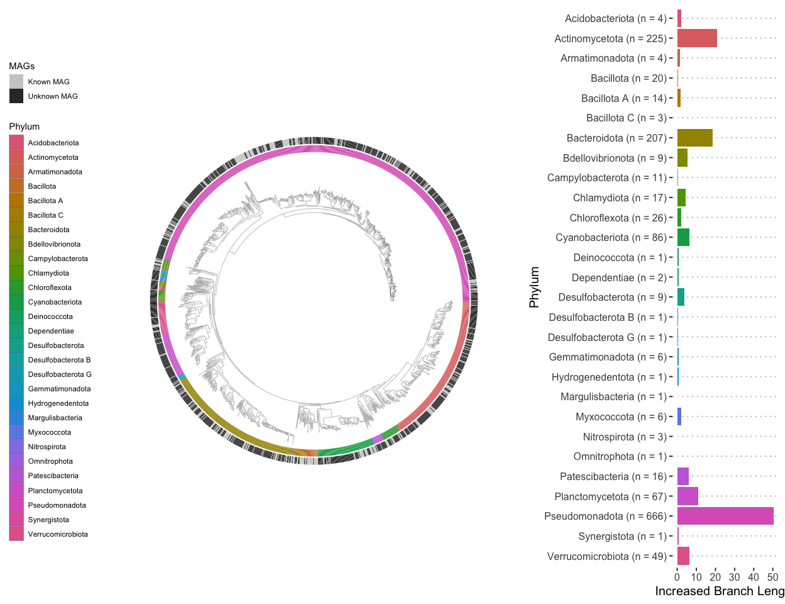

Metagenome Assembled Genomes
================

``` r
library("dplyr")
library("ggtree")
library("tidytree")
library("stringr")
library("ggtreeExtra")
library("ggnewscale")
library("ggplot2")
library("colorspace")
library("tibble")
library("ape")
library("ggpubr")

sessionInfo()
```

    ## R version 4.2.2 (2022-10-31)
    ## Platform: x86_64-apple-darwin17.0 (64-bit)
    ## Running under: macOS Big Sur ... 10.16
    ## 
    ## Matrix products: default
    ## BLAS:   /Library/Frameworks/R.framework/Versions/4.2/Resources/lib/libRblas.0.dylib
    ## LAPACK: /Library/Frameworks/R.framework/Versions/4.2/Resources/lib/libRlapack.dylib
    ## 
    ## locale:
    ## [1] en_US.UTF-8/en_US.UTF-8/en_US.UTF-8/C/en_US.UTF-8/en_US.UTF-8
    ## 
    ## attached base packages:
    ## [1] stats     graphics  grDevices utils     datasets  methods   base     
    ## 
    ## other attached packages:
    ##  [1] ggpubr_0.6.0      ape_5.7-1         tibble_3.2.1      colorspace_2.1-0 
    ##  [5] ggplot2_3.4.2     ggnewscale_0.4.8  ggtreeExtra_1.8.1 stringr_1.5.0    
    ##  [9] tidytree_0.4.2    ggtree_3.6.2      dplyr_1.1.2      
    ## 
    ## loaded via a namespace (and not attached):
    ##  [1] treeio_1.22.0      tidyselect_1.2.0   xfun_0.39          purrr_1.0.1       
    ##  [5] lattice_0.21-8     carData_3.0-5      ggfun_0.0.9        vctrs_0.6.2       
    ##  [9] generics_0.1.3     htmltools_0.5.5    yaml_2.3.7         utf8_1.2.3        
    ## [13] gridGraphics_0.5-1 rlang_1.1.0        pillar_1.9.0       glue_1.6.2        
    ## [17] withr_2.5.0        DBI_1.1.3          lifecycle_1.0.3    munsell_0.5.0     
    ## [21] ggsignif_0.6.4     gtable_0.3.3       evaluate_0.20      knitr_1.44        
    ## [25] fastmap_1.1.1      parallel_4.2.2     fansi_1.0.4        broom_1.0.4       
    ## [29] Rcpp_1.0.10        backports_1.4.1    scales_1.2.1       jsonlite_1.8.4    
    ## [33] abind_1.4-5        aplot_0.1.10       digest_0.6.31      stringi_1.7.12    
    ## [37] rstatix_0.7.2      grid_4.2.2         cli_3.6.1          tools_4.2.2       
    ## [41] yulab.utils_0.0.6  magrittr_2.0.3     lazyeval_0.2.2     patchwork_1.1.2   
    ## [45] car_3.1-2          tidyr_1.3.0        pkgconfig_2.0.3    ggplotify_0.1.0   
    ## [49] rmarkdown_2.25     rstudioapi_0.14    R6_2.5.1           nlme_3.1-162      
    ## [53] compiler_4.2.2

``` r
GTDB_bac_tree <- read.tree("./input/metagenome_assembled_genomes/FastTree_bacteria.tree")
GTDB_bac_info <- read.csv("./input/metagenome_assembled_genomes/gtdbtk.bac120.summary.tsv", sep = "\t")
GTDB_arc_info <- read.csv("./input/metagenome_assembled_genomes/gtdbtk.ar53.summary.tsv", sep = "\t")

extract_taxonomic_level <- function(string, prefix) {
  taxonomy_ranks <- strsplit(string, ";")[[1]]
  target <- taxonomy_ranks[startsWith(taxonomy_ranks, prefix)]
  target <- str_replace(target, prefix, "")
  if (grepl("_", target)) {
    target <- paste(strsplit(target, "_")[[1]][1], strsplit(target, "_")[[1]][2])
  } # avoid "Bacillota_A", etc.
  return(target)
}

GTDB_bac_info <- GTDB_bac_info %>% 
  select(user_genome, classification) %>%
  mutate(Superkingdom = sapply(classification, extract_taxonomic_level, "d__")) %>%
  mutate(Phylum = sapply(classification, extract_taxonomic_level, "p__")) %>%
  mutate(Class = sapply(classification, extract_taxonomic_level, "c__")) %>%
  mutate(Order = sapply(classification, extract_taxonomic_level, "o__")) %>%
  mutate(Family = sapply(classification, extract_taxonomic_level, "f__")) %>%
  mutate(Genus = sapply(classification, extract_taxonomic_level, "g__")) %>%
  mutate(Species = sapply(classification, extract_taxonomic_level, "s__")) %>%
  mutate(InDB = ifelse(Species == "", "No", "Yes"))

family_vector <- c()
for (family_name in unique(GTDB_bac_info$Family)) {
  n_in <- nrow(GTDB_bac_info %>% filter(Family == family_name) %>% filter(InDB == "Yes"))
  n_out <- nrow(GTDB_bac_info %>% filter(Family == family_name) %>% filter(InDB == "No"))
  family_vector <- setNames(c(family_vector, n_out), c(names(family_vector), family_name))
}

genus_vector <- c()
for (genus_name in unique(GTDB_bac_info$Genus)) {
  n_in <- nrow(GTDB_bac_info %>% filter(Genus == genus_name) %>% filter(InDB == "Yes"))
  n_out <- nrow(GTDB_bac_info %>% filter(Genus == genus_name) %>% filter(InDB == "No"))
  genus_vector <- setNames(c(genus_vector, n_out), c(names(genus_vector), genus_name))
}

GTDB_arc_info <- GTDB_arc_info %>% 
  select(user_genome, classification) %>%
  mutate(Superkingdom = sapply(classification, extract_taxonomic_level, "d__")) %>%
  mutate(Phylum = sapply(classification, extract_taxonomic_level, "p__")) %>%
  mutate(Class = sapply(classification, extract_taxonomic_level, "c__")) %>%
  mutate(Order = sapply(classification, extract_taxonomic_level, "o__")) %>%
  mutate(Family = sapply(classification, extract_taxonomic_level, "f__")) %>%
  mutate(Genus = sapply(classification, extract_taxonomic_level, "g__")) %>%
  mutate(Species = sapply(classification, extract_taxonomic_level, "s__"))

phylo_tbl <- as_tibble(GTDB_bac_tree)
phylum_colors <- setNames(qualitative_hcl(length(unique(GTDB_bac_info$Phylum))), sort(unique(GTDB_bac_info$Phylum)))
info_tree <- as.treedata(left_join(phylo_tbl, GTDB_bac_info, by = c("label" = "user_genome")))
circular_tree <- ggtree(info_tree, layout = "circular",  size = 0.1) +
  xlim(c(-3, NA))
circular_tree

meta_phylum_df <- GTDB_bac_info %>% select(user_genome, Phylum) %>% column_to_rownames("user_genome")
intermediate_tree <- gheatmap(circular_tree, meta_phylum_df,
                              offset = 0, width = 0.1, colnames = FALSE, color = NA) +
  scale_fill_manual("Phylum", values = phylum_colors, 
                    guide = guide_legend(ncol = 1, override.aes = list(colour = "black")))
#intermediate_tree

meta_novelty_df <- GTDB_bac_info %>% select(user_genome, InDB) %>% column_to_rownames("user_genome")
final_tree <- intermediate_tree + new_scale_fill()
final_tree <- gheatmap(final_tree, meta_novelty_df, offset = 0.32, width = 0.1, colnames = FALSE, color = NA) +
  scale_fill_manual("MAGs", values = setNames(c("grey80", "grey20"), c("Yes", "No")), breaks = c("Yes", "No"),
                    labels = setNames(c("Known MAG", "Unknown MAG"), c("Yes", "No")), guide = guide_legend(ncol = 1)) +
  theme(legend.position = "left")

unique_phylums <- unique(GTDB_bac_info$Phylum)
total_branch_len <- sum(GTDB_bac_tree$edge.length)
added_branch_len_list <- list()
for (phylum in unique_phylums) {
  novalspp_removed_phylo <- drop.tip(GTDB_bac_tree, GTDB_bac_info %>% filter(Phylum == phylum) %>% filter(InDB == "No") %>% pull(user_genome))
  added_branch_len <- total_branch_len - sum(novalspp_removed_phylo$edge.length)
  added_branch_len_list[[phylum]] <- added_branch_len
}
added_branch_len_df <- aggregate(values~ind, stack(added_branch_len_list), toString) %>% rename("Phylum" = "ind", "Branch.Length" = "values")
added_branch_len_df$Branch.Length <- as.numeric(added_branch_len_df$Branch.Length)
added_branch_len_df$Phylum <- factor(added_branch_len_df$Phylum, levels = sort(unique_phylums, decreasing = TRUE))
added_branch_len_df$NMAGs <- sapply(added_branch_len_df$Phylum, function(x){nrow(GTDB_bac_info %>% filter(Phylum == x))})
added_branch_len_df$label <- paste0(added_branch_len_df$Phylum, " (n = ", added_branch_len_df$NMAGs, ")")
phylum_colplot <- ggplot(added_branch_len_df) + 
  geom_bar(aes(y = Phylum, x = Branch.Length, fill = Phylum), stat = "identity") + 
  scale_y_discrete(labels = setNames(added_branch_len_df$label, added_branch_len_df$Phylum)) +
  scale_x_continuous("Increased Branch Length") +
  scale_fill_manual(values = phylum_colors, guide = "none") +
  theme_pubclean(base_size = 15)

ggarrange(final_tree, phylum_colplot, widths = c(2, 1))
```

<!-- -->
