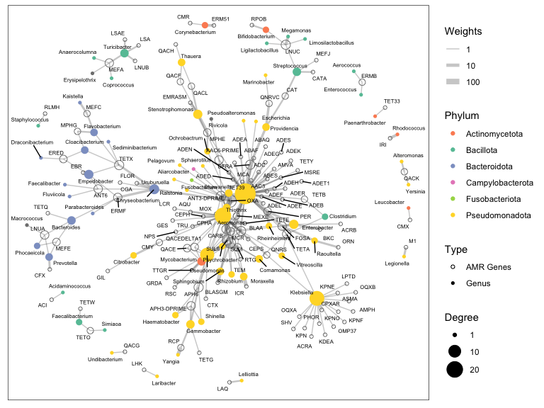

Network Analysis
================

``` r
library("dplyr")
library("readxl")
library("igraph")
library("ggraph")
library("readr")

sessionInfo()
```

    ## R version 4.2.2 (2022-10-31)
    ## Platform: x86_64-apple-darwin17.0 (64-bit)
    ## Running under: macOS Big Sur ... 10.16
    ## 
    ## Matrix products: default
    ## BLAS:   /Library/Frameworks/R.framework/Versions/4.2/Resources/lib/libRblas.0.dylib
    ## LAPACK: /Library/Frameworks/R.framework/Versions/4.2/Resources/lib/libRlapack.dylib
    ## 
    ## locale:
    ## [1] en_US.UTF-8/en_US.UTF-8/en_US.UTF-8/C/en_US.UTF-8/en_US.UTF-8
    ## 
    ## attached base packages:
    ## [1] stats     graphics  grDevices utils     datasets  methods   base     
    ## 
    ## other attached packages:
    ## [1] readr_2.1.4   ggraph_2.1.0  ggplot2_3.4.2 igraph_1.4.2  readxl_1.4.2 
    ## [6] dplyr_1.1.2  
    ## 
    ## loaded via a namespace (and not attached):
    ##  [1] Rcpp_1.0.10        cellranger_1.1.0   pillar_1.9.0       compiler_4.2.2    
    ##  [5] viridis_0.6.2      tools_4.2.2        digest_0.6.31      viridisLite_0.4.1 
    ##  [9] evaluate_0.20      lifecycle_1.0.3    tibble_3.2.1       gtable_0.3.3      
    ## [13] pkgconfig_2.0.3    rlang_1.1.0        tidygraph_1.2.3    cli_3.6.1         
    ## [17] rstudioapi_0.14    ggrepel_0.9.3      yaml_2.3.7         xfun_0.39         
    ## [21] fastmap_1.1.1      gridExtra_2.3      withr_2.5.0        knitr_1.44        
    ## [25] hms_1.1.3          graphlayouts_1.0.0 generics_0.1.3     vctrs_0.6.2       
    ## [29] grid_4.2.2         tidyselect_1.2.0   glue_1.6.2         R6_2.5.1          
    ## [33] fansi_1.0.4        rmarkdown_2.25     polyclip_1.10-4    tzdb_0.3.0        
    ## [37] farver_2.1.1       tweenr_2.0.2       tidyr_1.3.0        purrr_1.0.1       
    ## [41] magrittr_2.0.3     scales_1.2.1       htmltools_0.5.5    MASS_7.3-58.3     
    ## [45] ggforce_0.4.1      colorspace_2.1-0   utf8_1.2.3         munsell_0.5.0

``` r
options(ggrepel.max.overlaps = Inf)
summary_df <- read_excel("./input/network_analysis/Contig_ARG_annotation_summary.xlsx")
filtered_summary_df <- summary_df %>% filter(ARG == "Yes")
lineage_info <- read_csv("./input/lineage_info.csv", col_names = TRUE)
for (colname in c("TaxPhylum", "TaxClass", "TaxOrder", "TaxFamily", "TaxGenus", "TaxSpecies")) {
  lineage_info[[colname]] <- make.names(lineage_info[[colname]])
}

find_taxa <- function(col_cat, col_kraken) {
  if (is.na(col_cat)) {
    if (is.na(col_kraken)) {
      val <- NA
    } else {
      val <- col_kraken
    }
  } else {
    col_cat <- strsplit(col_cat, " ")[[1]][1]
    val <- col_cat
  }
}

AMR_genes <- unique(summary_df$AMR.Gene)
gene_distribution_df <- data.frame(matrix(nrow = 0, ncol = 3))
colnames(gene_distribution_df) = c("Gene", "Plasmid_Count", "Chromosome_Count")
for (AMR_gene in AMR_genes) {
  temp_df <- summary_df %>% filter(AMR.Gene == AMR_gene)
  pla_count <- sum(temp_df$Contig.Origin == "Plasmid")
  chr_count <- sum(temp_df$Contig.Origin == "Chromosome")
  temp_list <- list("Gene" = AMR_gene, "Plasmid_Count" = pla_count, "Chromosome_Count" = chr_count)
  gene_distribution_df <- rbind(gene_distribution_df, temp_list)
}

filtered_summary_df$Genus <- mapply(find_taxa, filtered_summary_df$CAT.Genus, filtered_summary_df$Kraken2.Genus)
filtered_summary_df$Superkingdom <- mapply(find_taxa, filtered_summary_df$CAT.Superkingdom, filtered_summary_df$Kraken2.Superkingdom)
filtered_summary_df <- filtered_summary_df %>% filter(!is.na(Genus)) %>% filter(Contig.Origin == "Chromosome")

network_table <- table(filtered_summary_df$AMR.Gene, filtered_summary_df$Genus)
network_data <- matrix(network_table, ncol = ncol(network_table), dimnames = dimnames(network_table))
filtered_lineage <- lineage_info %>% filter(TaxGenus %in% colnames(network_data)) %>% distinct(TaxGenus, .keep_all = TRUE)
genus_to_phylum <- setNames(filtered_lineage$TaxPhylum, filtered_lineage$TaxGenus)

tax_res_graph <- graph.incidence(network_data, weighted = TRUE)
V(tax_res_graph)$degree <- degree(tax_res_graph)
V(tax_res_graph)$phylum <- genus_to_phylum[V(tax_res_graph)$name]

# plot without annotation
set.seed(2023)
ggraph(tax_res_graph, "igraph", algorithm = "nicely") + 
  geom_edge_link0(aes(width = weight), edge_alpha = 0.3, color = "grey30") + 
  geom_node_point(aes(color = phylum, size = degree, shape = type)) + 
  scale_edge_width_continuous(name = "Weights", breaks = c(1, 10, 100), trans = "log10", range = c(0.5, 3)) +
  scale_size_continuous(name = "Degree", breaks = c(1, 10, 20, 40), range = c(1.5, 10)) +
  scale_color_manual(name = "Phylum", values = c("#fc8d62", "#66c2a5", "#8da0cb", "#e78ac3", "#a6d854", "#ffd92f"), 
                     na.value = "grey50", 
                     breaks = c("Actinomycetota", "Bacillota", "Bacteroidota", "Campylobacterota", 
                                "Fusobacteriota", "Pseudomonadota")) +
  scale_shape_manual(name = "Type", values = setNames(c(16, 1), c(TRUE, FALSE)), labels = c("Genus", "AMR Genes")) +
  ggforce::theme_no_axes()
```

<!-- -->

``` r
# plot with full annotations
set.seed(2023)
ggraph(tax_res_graph, "igraph", algorithm = "nicely") + 
  geom_edge_link0(aes(width = weight), edge_alpha = 0.3, color = "grey30") + 
  geom_node_point(aes(color = phylum, size = degree, shape = type)) + 
  geom_node_text(aes(label = name, size = degree), color = 'black', size = 2, repel = TRUE) +
  scale_edge_width_continuous(name = "Weights", breaks = c(1, 10, 100), trans = "log10", range = c(0.5, 3)) +
  scale_size_continuous(name = "Degree", breaks = c(1, 10, 20, 40), range = c(1.5, 10)) +
  scale_color_manual(name = "Phylum", values = c("#fc8d62", "#66c2a5", "#8da0cb", "#e78ac3", "#a6d854", "#ffd92f"), 
                     na.value = "grey50", 
                     breaks = c("Actinomycetota", "Bacillota", "Bacteroidota", "Campylobacterota", 
                                "Fusobacteriota", "Pseudomonadota")) +
  scale_shape_manual(name = "Type", values = setNames(c(16, 1), c(TRUE, FALSE)), labels = setNames(c("Genus", "AMR Genes"), c(TRUE, FALSE))) +
  ggforce::theme_no_axes()
```

<!-- -->
